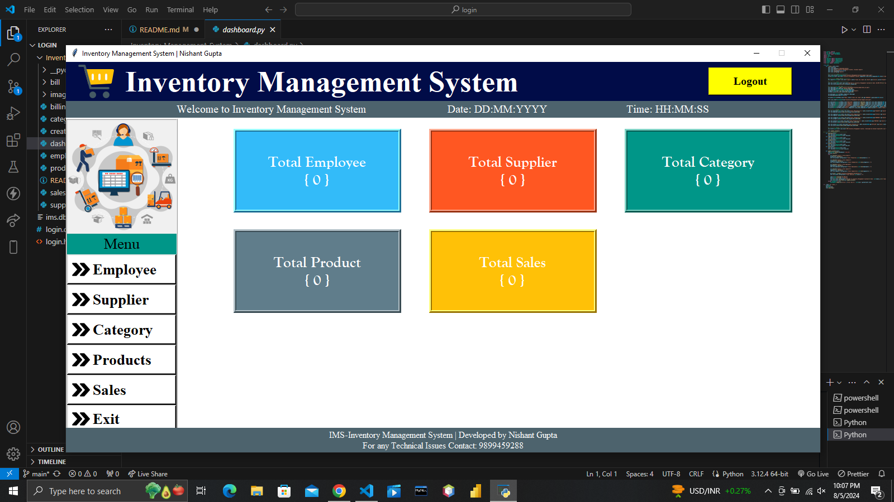
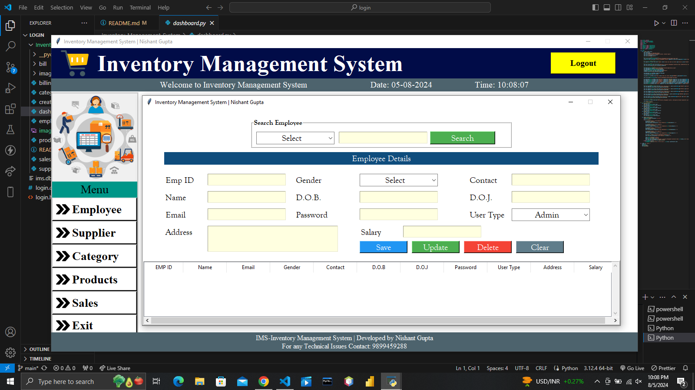
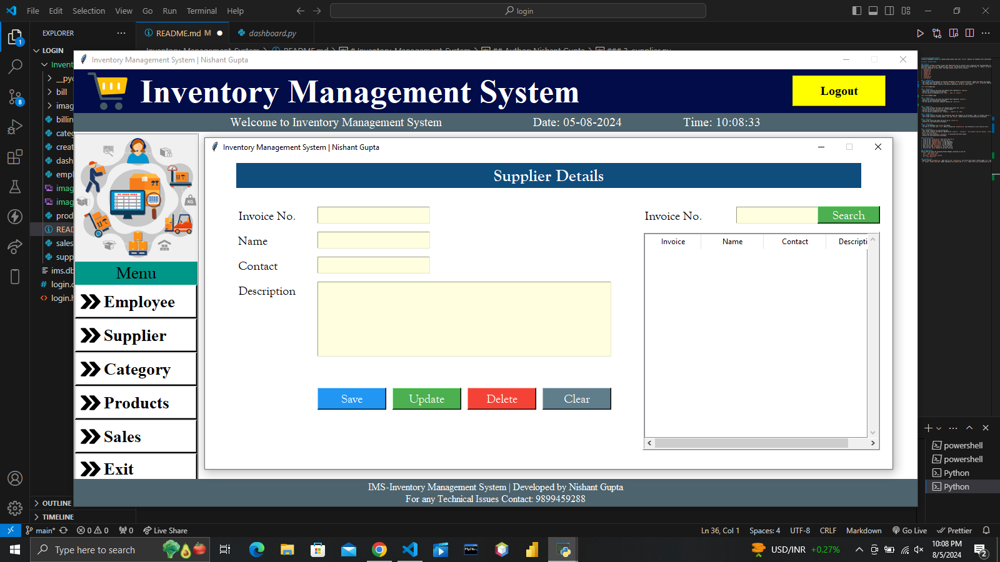
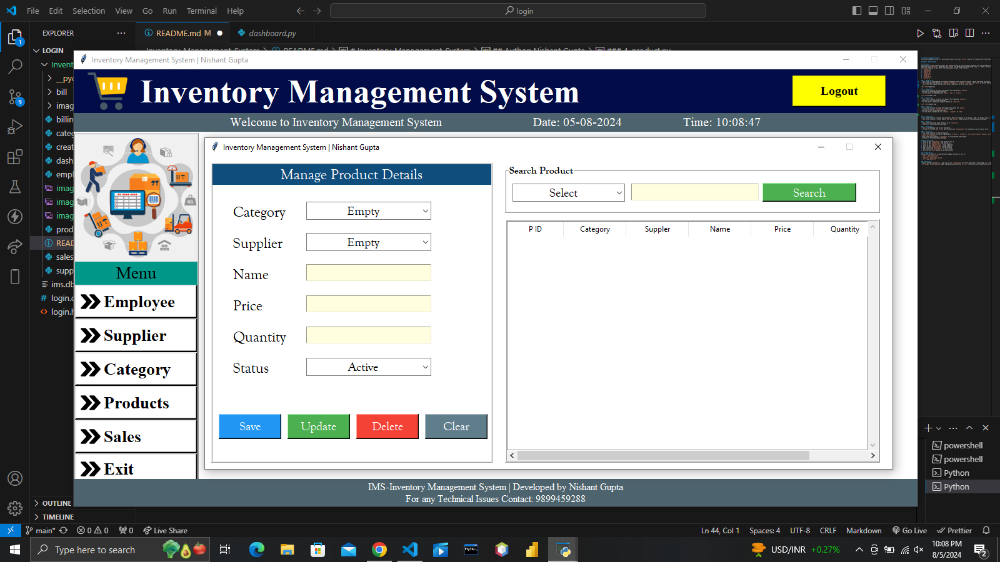
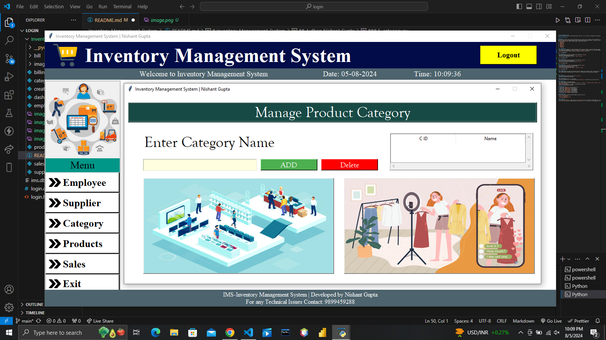
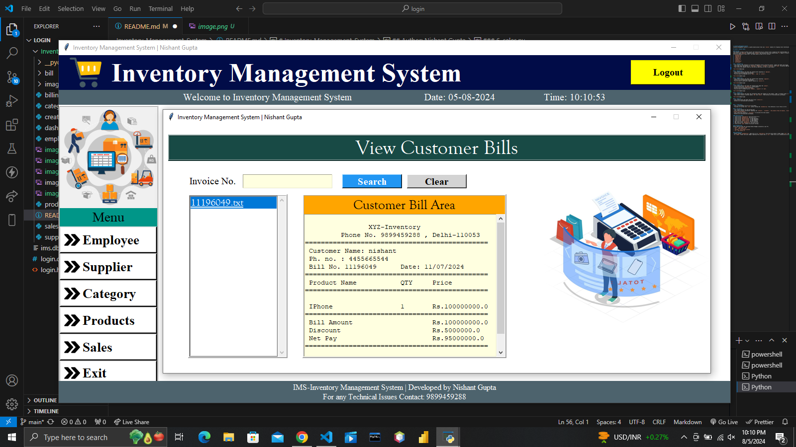
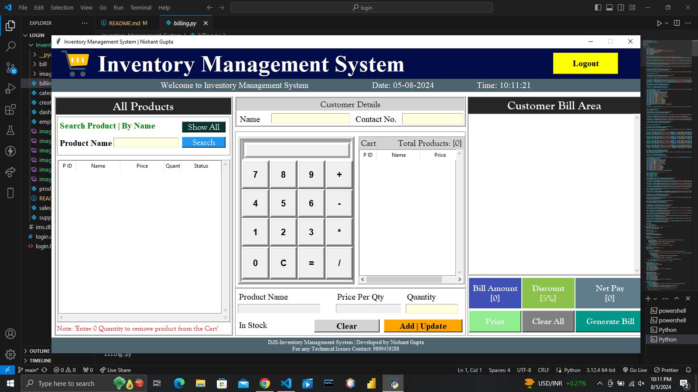

# Inventory-Management-System
Inventory Management System is a python based project that uses `tkinter` modules for Graphical User Interface(GUI)

## Author: Nishant Gupta

### Overview
This project includes 12 python scripts that demonstrate how to interact with a Graphical User Interface(GUI) using `tkinter`, manage images using `pil`, date/time using `datetime`, database using `sqlite3` and fetching files from system using `os` module. In this project, there are total 12 python scripts which are connected to each other. The twelve python scripts are as follows:-
1. `dashboard.py`
2. `employee.py`
3. `supplier.py`
4. `product.py`
5. `category.py`
6. `sales.py`
7. `create_db.py`
8. `billing.py`
9. `attendance.py`
10. `salary_report.py`
11. `qr_generator.py`

### 1. dashboard.py
- This script is the dashboard of Inventory Management System containing buttons, images and labels and timing.
- The screen shows the options for `Employee`, `Supplier`, `Category`, `Products`, `Sales`, `Attendance`, `Salary` and `QR Codes` to perform CRUD operations.
- This screen also updates timely as you perform operations on any of these Labels.



### 2. employee.py
- This screen collects and shows the complete data regarding an `employee`.
- Buttons are functionalised accordingly.
- You can search an employee by its `email`, `name` or `contact`.



### 3. supplier.py
- This screen collects and shows the complete data regarding `suppliers`.
- Buttons are functionalised accordingly.
- You can search a particular supplier details by `invoice no`.



### 4. product.py
- This screen collects and shows the complete data about the `product`.
- It also ensures the `availability` of the product
- Buttons are functionalised accordingly.
- You can search a product by its `category`, `supplier` or `name`.



### 5. category.py
- This screen collects and shows the information about the category of the product. LIKE:- If Product name is `IPhone` then its category is `Phone`.
- This screen contains 2 buttons namely `add` and `delete`. These buttons are functionalised accordingly.



### 6. sales.py
- This screen stores and shows the bills by an `invoice no`.
- Buttons are functionalised accordingly.



### 7. creat_db.py
- This is the database file for all the tables.
- You have to run this file `first` before running the `dashboard.py` file otherwise it will throw an error.

### 8. billing.py
- This screen contains all the billing part.
- This screen contains information regarding the `products`, `customers`, `the products they are buying`, `billing structure`, `price of product`, `discout on the products`.
- This screen also contains a `calculator` to calculate the total amount.
- Buttons are functionalised accordingly.



### 9. attendance.py
- This module implements an attendance system using webcam and QR code scanning.
- Employees can check in and check out by scanning their employee QR code.
- The system records time in, time out, and calculates hours worked.
- Attendance records can be searched by employee ID or date.

### 10. salary_report.py
- This module generates salary reports based on attendance records.
- It calculates employee salaries based on their work hours and attendance.
- Reports can be generated for specific months and years.
- Reports can be exported to CSV or printed.

### 11. qr_generator.py
- This module generates QR codes for employees to use with the attendance system.
- QR codes contain the employee ID for quick scanning.
- Generated QR codes can be saved and printed for employee ID cards.

#### Detailed Steps:
1. Click on the `create_db.py` file first and run it.
2. Click on the `dashboard.py` file and run it.
3. Click on the `employee button` to add employees.
4. Click on the `supplier button` to add suppliers.
5. Click on the `products button` to add products.
6. Click on the `QR Codes` button to generate QR codes for employees.
7. Click on the `Attendance` button to record employee attendance using the webcam.
8. Click on the `Salary` button to generate salary reports based on attendance.
9. Click on the `billing.py` file for billing.
10. Click on the `dashboard.py` file and run it.
11. Click on the `sales` button to see your billing.

### Pre-Requisites
Ensure that you have the following Python Packages installed in your PC:
- `time`: `pip install time`
- `pil`: `pip install Pillow`
- `sqlite3`: `pip install sqlite3`
- `os`: `pip install os`
- `opencv-python`: `pip install opencv-python`
- `pyzbar`: `pip install pyzbar`
- `qrcode`: `pip install qrcode`

### Configuration
- Before running `dashboard.py`, make sure to run `create_db.py` file first and create a folder named `bill` and `images`.
- In `images` folder save your images regarding this project and in `bill` folder bills will automatically be saved.

### Attendance System Setup
1. Install the required packages for the attendance system:
   ```
   pip install opencv-python pyzbar qrcode
   ```
2. Run the QR Generator to create QR codes for employees.
3. Print the QR codes and distribute to employees.
4. Use the Attendance module to scan employee QR codes when they arrive and leave.
5. Use the Salary Report module to calculate salaries based on attendance.